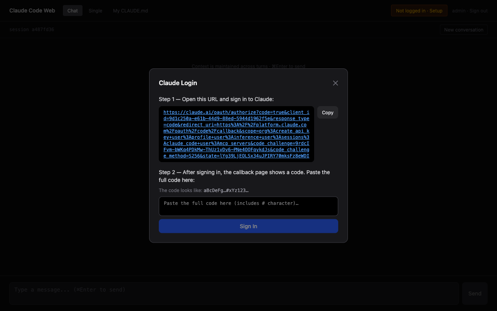

# claude-code-web

Chat UI for [claude-code-api](https://github.com/exitxio/claude-code-api). \
No API key — runs on your existing Claude subscription. \
One-command Docker deploy.





## Architecture

```
Browser
    ↓
claude-code-web (Next.js — auth, chat UI)
    ↓ HMAC token via exitx network
claude-code-api (worker pool + queue)
    ↓ Agent SDK
Claude Code CLI (agent execution)
```

- **claude-code-web** — Chat UI, user authentication, proxies requests to the API
- **[claude-code-api](https://github.com/exitxio/claude-code-api)** — Agent engine, worker pool, HTTP API with API key auth

## Quick Start

claude-code-api must be running first. See [claude-code-api](https://github.com/exitxio/claude-code-api) for setup.

```bash
git clone https://github.com/exitxio/claude-code-web.git
cd claude-code-web
cp .env.example .env
# NEXTAUTH_SECRET= (must match claude-code-api)
# USERS=admin:yourpassword

docker compose up --build
```

For production (pre-built images, no local build):
```bash
docker compose -f docker-compose.prod.yml up
```

Open http://localhost:3000 → log in → click **"Not logged in · Setup"** in the header → authenticate with your Claude account via OAuth.

## Networking

claude-code-web and claude-code-api run as **separate** Docker Compose stacks, connected via a shared `exitx` network.

```
claude-code-api (port 8080)  ──┐
                                ├── exitx network
claude-code-web (port 3000)  ──┘
```

claude-code-api creates the network. claude-code-web joins as external:

```yaml
# docker-compose.yml
services:
  web:
    environment:
      - AUTOMATION_SERVER_URL=http://claude-code-api:8080  # env name kept for backward compat
    networks:
      - exitx

networks:
  exitx:
    external: true
```

**Start order:** api first, then web.

```bash
# 1. Start API
cd claude-code-api && docker compose up -d

# 2. Start Web
cd claude-code-web && docker compose up -d
```

## Features

- **Multi-turn sessions** — per-user context persistence
- **Single-shot mode** — stateless worker pool for one-off requests
- **Personal CLAUDE.md** — per-user custom instructions
- **Web OAuth** — authenticate with your Claude subscription, no API key
- **Credentials auth** — env-based user management, no database

## Configuration

| Variable | Default | Description |
|----------|---------|-------------|
| `NEXTAUTH_SECRET` | **required** | Random secret for JWT signing (must match api) |
| `NEXTAUTH_URL` | `http://localhost:3000` | Public URL of the app |
| `USERS` | — | `username:password` pairs, comma-separated |
| `PORT` | `3000` | Web port |

## Claude Authentication

Credentials are stored in a named Docker volume (`claude-auth`) on the **api** container. No local `~/.claude` mount required.

1. Open the app and log in
2. Click **"Not logged in · Setup"** in the header
3. Follow the OAuth link to claude.ai and sign in
4. Copy the code from the callback page and paste it back
5. Workers restart automatically — ready to use immediately

## Development

The web UI and API server are separate projects. For local development:

```bash
# Terminal 1 — run the API server
cd ../claude-code-api
pnpm install
pnpm dev

# Terminal 2 — run the web UI
pnpm install
cp .env.example .env.local
pnpm dev
```

## HTTP API

The HTTP API is served by `claude-code-api`. See the [claude-code-api README](https://github.com/exitxio/claude-code-api) for full API documentation, including API key authentication for external integrations (bots, CI, etc.).

## Docs

- [Security](docs/security.md) — permission modes, network security, credential storage
