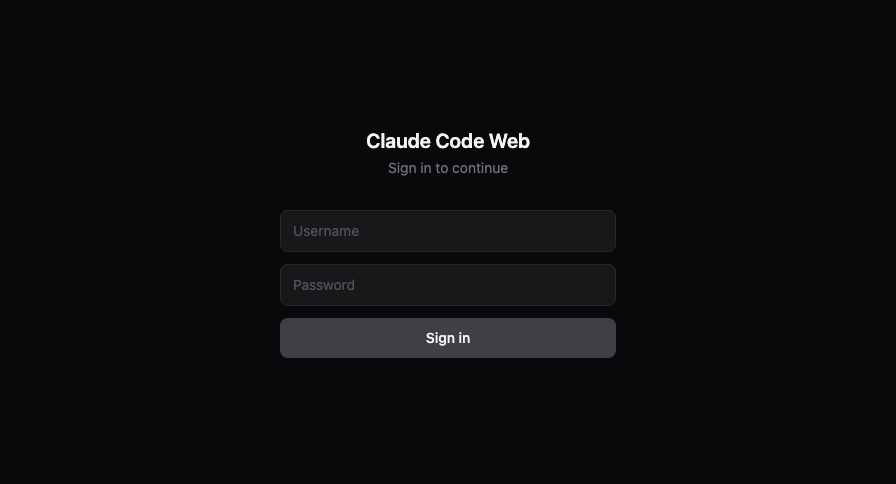
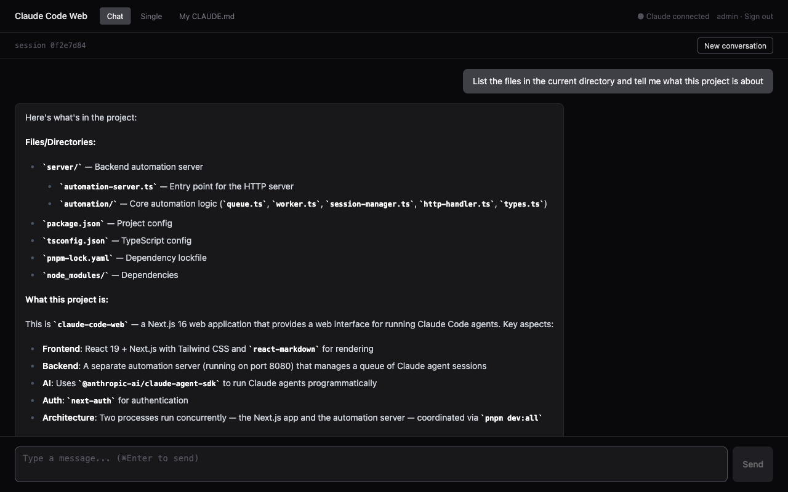
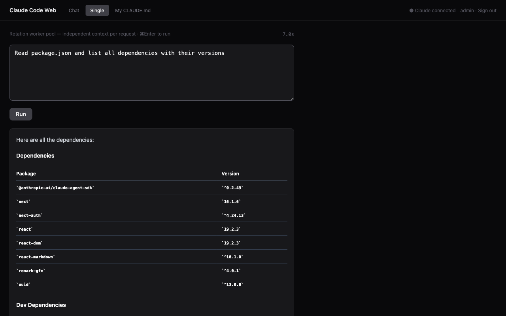
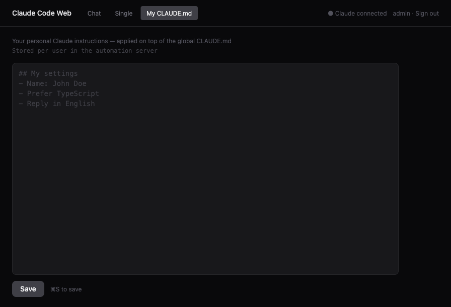

# claude-code-web

Self-hosted server that exposes the Claude Code agent as an HTTP endpoint. \
No API key — runs on your existing Claude subscription. \
One-command Docker deploy.






## What is this?

claude.ai is a chat UI. This is different.

It exposes the **Claude Code CLI agent** — file reading/writing, shell command execution, tool use — as an HTTP endpoint.

```bash
curl -X POST http://localhost:8080/run \
  -H "Authorization: Bearer $TOKEN" \
  -d '{"prompt": "Find all any types in this directory and fix them"}'

# {"success": true, "output": "...", "durationMs": 8432}
```

The web UI is just one interface on top of that.

## Use Cases

- **Slack/Discord bot** — receive message → `POST /run` → send response
- **CI code review** — PR diff → `POST /run` → post review comment
- **n8n / Make automation** — connect Claude Code via HTTP node
- **Batch processing** — document summarization, translation, analysis pipelines
- **Personal AI gateway** — deploy on your server, access from any browser

## Quick Start

```bash
cp .env.example .env
# NEXTAUTH_SECRET=$(openssl rand -base64 32)
# USERS=admin:yourpassword

docker compose up --build
```

Open http://localhost:3000 → log in → click **"Not logged in · Setup"** in the header → authenticate with your Claude account via OAuth.

## How It Differs

| | CloudCLI / claude-code-webui | **claude-code-web** |
|---|---|---|
| Integration | CLI spawn + stdout parsing | **Agent SDK direct call** |
| HTTP API | None | **`POST /run` endpoint** |
| External access | Web UI only | **curl, scripts, bots, CI** |
| Auth | Local `~/.claude` mount | **Web OAuth (inside Docker)** |

## Features

- **`POST /run`** — call the Claude Code agent over HTTP
- **Multi-turn sessions** — per-user context persistence
- **Single-shot mode** — stateless worker pool for one-off requests
- **Personal CLAUDE.md** — per-user custom instructions
- **Web OAuth** — authenticate with your Claude subscription, no API key
- **Credentials auth** — env-based user management, no database

## Configuration

| Variable | Default | Description |
|----------|---------|-------------|
| `NEXTAUTH_SECRET` | **required** | Random secret for JWT signing |
| `NEXTAUTH_URL` | `http://localhost:3000` | Public URL of the app |
| `USERS` | — | `username:password` pairs, comma-separated |
| `CLAUDE_MODEL` | `claude-sonnet-4-6` | Claude model to use |
| `AUTOMATION_POOL_SIZE` | `1` | Number of pre-warmed workers |
| `PORT` | `3000` | Web port |

## Claude Authentication

Credentials are stored in a named Docker volume (`claude-auth`). No local `~/.claude` mount required.

1. Open the app and log in
2. Click **"Not logged in · Setup"** in the header
3. Follow the OAuth link to claude.ai and sign in
4. Copy the code from the callback page and paste it back
5. Workers restart automatically — ready to use immediately

## Development

```bash
pnpm install
cp .env.example .env.local
pnpm dev:all
```

## Architecture

```
Browser / curl
    ↓
Next.js (auth, UI, proxy)
    ↓ HMAC token
automation-server (worker pool)
    ↓ Agent SDK
Claude Code CLI (agent execution)
```

- **automation-server** — manages sessions via `@anthropic-ai/claude-agent-sdk`. Does not spawn the CLI as a subprocess.
- **Worker pool** — pre-warmed sessions minimize first-response latency

## Docs

- [Security](docs/security.md) — permission modes, network security, credential storage
